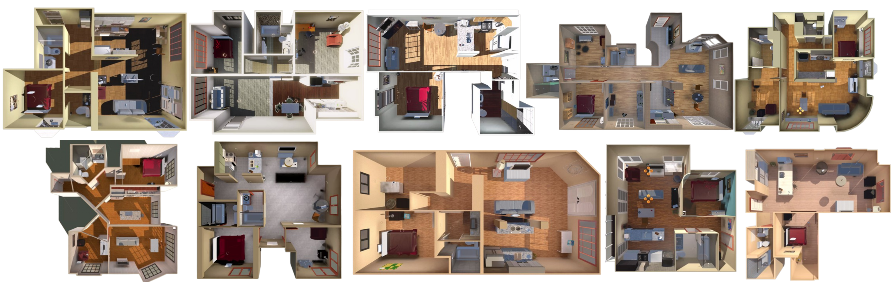
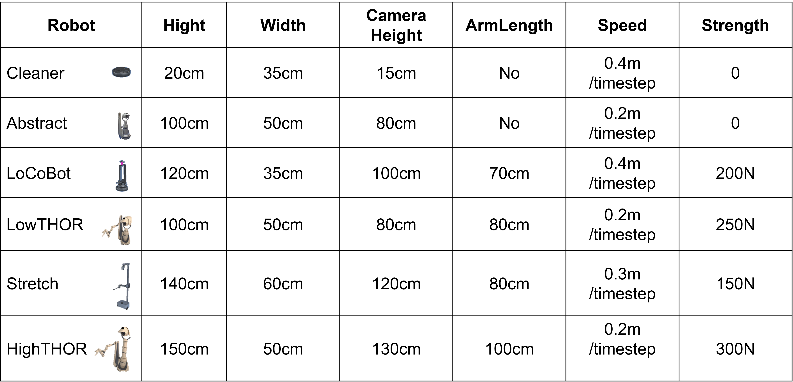

# Proactive Collaboration via Autonomous Interaction

Human teams excel at dynamically restructuring both task assignments and team composition in response to emerging
challenges, proactively recruiting or releasing members as needed. This capacity for autonomous adaptation is a cornerstone
of effective teamwork, yet remains difficult to achieve in heterogeneous multi-robot systems, which typically operate under
fixed team configurations or adapt only responsively to external disruptions. In this work, we present a systematic investigation of the Proactive Collaboration paradigm for robot teams, where the working team autonomously recruits or releases members as tasks evolve. We implement this paradigm by equipping robots with the developed Autonomous Interaction framework, which utilizes need-driven multi-round communication to facilitate discussions over task progress, negotiated task allocation, and dynamic team resizing. Through real-world and simulated experiments, we demonstrate that our framework effectively realizes the Proactive Collaboration. By resolving capability gaps via anticipatory planning and minimizing action redundancy, it yields consistent and measurable gains in team efficiency and robustness. Our findings suggest that enabling individual-level initiative may offer a promising pathway toward more adaptive and cohesive collective behavior in multi-robot systems.

> We get pleasure from helping other people, but we find it difficult to ask for help for ourselves.

---


## DynaTeamThor

To the best of our knowledge, no benchmark dataset exists for heterogeneous proactive collaboration. Therefore, we develop DynaTeamTHOR, a multi-robot collaboration environment built on the *HumanThor* framework, and introduce a benchmark task for household tidying-up. This task is particularly well-suited for evaluating the performance of heterogeneous proactive collaboration, as it involves a variety of challenges that require collaboration, adaptability, and efficient division of labor among robots with different capabilities.

DynaTeamTHOR includes **10** multi-room house settings, each containing over **50** objects, and supports **collaborative pull and push actions** by robots, as shown in Fig.[1](#fig-scene_thor). The platform integrates the THOR simulator, powered by the Unity physics engine, with Python-based software to manage robot configurations and environment settings through HTTP-based APIs. 

<a id="fig-scene_thor"></a> 


Each robot's physical attributes are represented as a tuple, $(\alpha_{nav}, manip, h, w, cam)$, where $\alpha_{nav}$ denotes navigation ability in terms of moving speed, $manip$ refers to manipulation capabilities, including range, height bounds, and strength (indicating the maximum force for pushing or pulling objects), $h$ and $w$ represent height and width, affecting mobility, and $cam$ specifies the camera viewpoint, influencing perception. 

As illustrated in Fig. [2](#fig-robot_in_thor), DynaTeamTHOR defines six distinct robot configurations, offering flexibility to set performance parameters such as $speed$ and $strength$, enabling diverse robot capabilities for various tasks.

<a id="fig-robot_in_thor"></a> 


---


## System requirements
Our environment and codebase have been tested across multiple platforms, including Linux (Ubuntu 22.04), macOS (Tahoe), and Windows 10. No specialized hardware or specific operating system is required for deployment.


## Environment Setup

For DynaTeamThor, we provide the full Unity source code to ensure cross-platform compatibility (Linux, macOS, and Windows). We highly recommend compiling the environment from source if you wish to customize the API port or extend the environment's functionality. Additionally, we provide pre-compiled executables for all three operating systems with a pre-configured API port.


#### Project Code and Resources Download

The complete project code and related resources are stored in OneDrive:

[📂 Click here to access the files](https://1drv.ms/f/c/83bc33e10536c5f9/IgAW5RXxIlhOTorqS70qqwwUAbCTxHH3Z8IriVwVH0gU4E8?e=ub1jZb)

You need to have at least 15 GB of free space to download all files.

Please make sure to download all files before proceeding with the setup.


#### Environment Requirements

* Unity Version: 2021.3.11f1 (exact version required to ensure compatibility)
* Unity Hub: Recommended for managing Unity installations and opening the project.
* Disk Space: At least 30GB of free space for the Unity project and build process.


#### Deployment Steps

1. Download the Project Files

  - Use the above OneDrive link to download the entire project folder.
    - Ensure the folder structure remains intact after extraction.

2.	Install the Required Unity Version
   - Open Unity Hub → Installs → Add → Select version **2021.3.11f1** (https://unity.cn/release-notes/full/2021/2021.3.11f1).

3.	Open the Project in Unity Hub
   - In Unity Hub, click Open and select the downloaded project folder.
   - Unity may take several minutes to import all assets for the first time.

4.	Resolve Missing Packages (if any)
   - If Unity prompts for missing packages, click Install/Update to resolve them.

5.	Run the Project
   - In Unity, open the main scene from the Assets/Scenes directory.
   - Click the Play button to run the project in the editor.

6.	Build & Deploy
   - Go to File → Build Settings.
   - Select the target platform (e.g., Windows, Mac, Android).
   - Click Build or Build and Run.

#### Notes

* For first-time setup, Unity will automatically re-import assets; this may take 30–100 minutes depending on your hardware.
* If you encounter shader or lighting issues, try Edit → Render Pipeline → Upgrade Project Materials.
* Keep the Unity version fixed to **2021.3.11f1** to avoid compatibility issues.

If you don't want to compile it by yourself, we also provide pre-compiled executables for all three operating systems (Linux, MacOS, Windows) with a pre-configured API port:

[📂 Click here to access the files](https://1drv.ms/f/c/83bc33e10536c5f9/IgARVgOKL8QHTqAilxKK5MVYAY2TeVExKYkf0RJrbAdAGzA?e=uzyI6r)


### Python setup

Once Python (Python 3.8+) is installed and unity environment have been built, you will need to install the project dependencies. Clone this repository to your local machine, navigate to the cloned directory, and run the following command:

```bash
pip install -r requirements.txt
```

This command installs all the necessary Python packages listed in the requirements.txt file.

### Running the Demo

To run the demonstration code, execute the following script. This may cost 5-10 minutes. Please replace the URL with the one corresponding to your compiled environment executable:

```bash
# Example: python demonstration_proactive.py --remote_url "http://127.0.0.1:1234/"
python demonstration_proactive.py --remote_url "<YOUR_ENVIRONMENT_URL>"
```

#### Expected Outputs 

Upon completion, the demo will generate the following outputs:

- Test Results (./output/demo/): Saved in JSON format, this file contains key evaluation metrics including: task success status, temporal_step, action_step, total_member, average_team_size, external_help_count, and total_comm_cost.

- Execution Logs (./logs/demo/): Comprehensive logs detailing the runtime process, including action decisions, detected environmental information, and communication events.


### Instructions for use
#### How to run the software on your data
To evaluate the framework on your own custom scenarios, you need to prepare your data in JSON format and configure the environment accordingly:

- Prepare your dataset: Navigate to the ./datasets directory and review the provided JSON templates. Create a new JSON file for your custom scenario.
- Configure the parameters: In your new JSON file, define your specific setup by modifying key fields such as robot_team (to configure your agent setups) and misplaced_objects (to define the initial state of the environment).
- Run the script: Start the evaluation by specifying your environment URL and experiment name. 

```bash
python main.py --scene <custom_scene_identifier> --remote_url "<YOUR_ENVIRONMENT_URL>" --exp_name "YOUR_EXPERIMENT_NAME"
```

#### Reproduction instructions
To reproduce the specific experiments and quantitative results presented in the manuscript, you need to execute all predefined dataset (from scene 0 to 9).

Run the following command sequentially for each scene:

```bash
# Example: python main.py --scene 0 --remote_url "http://127.0.0.1:1234/" --exp_name "qwen3-max"
python main.py --scene 0 --remote_url "<YOUR_ENVIRONMENT_URL>" --exp_name "YOUR_EXPERIMENT_NAME"
```

